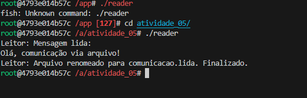

# S.O. 2025.1 - Atividade 05 - Prática de comunicação de tarefas

**Nome**: Isabella Camilli Meletani<br>
**Data**: 06/06/2025

## 1. Introdução

Nesta atividade, exploraremos diferentes mecanismos de comunicação entre tarefas em sistemas operacionais, utilizando a linguagem C no ambiente Linux. O foco principal está no estudo do escalonamento de tarefas e na comunicação entre processos e threads, dois conceitos fundamentais para o desenvolvimento de aplicações concorrentes e paralelas.

Inicialmente, trabalharemos com comunicação via arquivos, onde processos distintos trocam informações escrevendo e lendo arquivos no sistema de arquivos. Em seguida, avançaremos para comunicação usando memória compartilhada, que permite um acesso direto e eficiente a uma região de memória comum entre processos.

A prática também propõe a reimplementação dos exemplos usando threads, com o objetivo de compreender as diferenças de complexidade e desempenho entre processos e threads no gerenciamento de tarefas pelo sistema operacional.

Ao final, será necessário comparar as abordagens em termos de simplicidade de implementação e tempo de execução, consolidando os conceitos teóricos com a experiência prática.

## 2. Prática

Iniciei a prática realizando o build da imagem do container utilizando o Dockerfile previamente configurado com o sistema Fedora e as ferramentas necessárias, incluindo o compilador gcc. Após a conclusão do build, entrei no ambiente do container para garantir que todos os pré-requisitos estavam corretamente instalados e o sistema estava pronto para compilar e executar os programas em C relativos à comunicação entre processos.


A seguir, compilei ambos os arquivos fontes utilizando o compilador gcc, gerando os executáveis para os programas escritor (`writer`) e leitor (`reader`).

Executei o programa writer, que tem a função de criar e abrir o arquivo comunicacao.txt em modo de escrita. Ele grava uma mensagem pré-definida no arquivo e fecha o fluxo. Após escrever, o programa entra em um loop de espera, verificando continuamente se o arquivo ainda existe.


Após iniciar o programa writer-file e confirmar que ele estava aguardando a leitura do arquivo, executei o programa `reader` em outro terminal. O leitor abriu o arquivo comunicacao.txt, leu a mensagem gravada pelo escritor e exibiu seu conteúdo na tela. Em seguida, renomeou o arquivo para comunicacao.lida, sinalizando que a leitura foi concluída. Com isso, o programa escritor detectou a alteração, saiu do loop de espera e finalizou sua execução, encerrando todo o processo de comunicação via arquivo.




Realizamos a compilação dos arquivos fonte da mesma forma que nos programas anteriores.
O programa writer-mem é responsável por criar um segmento de memória compartilhada no sistema, usando a chave única definida (key = 1234). Após criar ou obter o segmento, o escritor anexa essa memória ao seu espaço de endereço e escreve uma mensagem pré-definida diretamente nessa área compartilhada. Em seguida, o programa entra em um loop de espera, monitorando o primeiro byte da memória para detectar quando o leitor terminar a leitura e sinalizar a conclusão modificando esse byte para um caractere específico ('*'). Após receber essa sinalização, o escritor desanexa e remove o segmento de memória compartilhada, liberando os recursos e finalizando sua execução.


O programa reader-mem tem a função de acessar o segmento de memória compartilhada criado pelo escritor. Utilizando a mesma chave única (key = 1234), o leitor obtém o identificador do segmento e anexa essa memória ao seu espaço de endereçamento. Em seguida, lê a mensagem armazenada na memória compartilhada e a exibe na tela. Para sinalizar que terminou a leitura, o leitor modifica o primeiro byte da memória para o caractere '*', informando assim o escritor de que pode liberar o recurso. Por fim, o leitor desanexa o segmento de memória compartilhada e finaliza sua execução, garantindo uma comunicação sincronizada e eficiente entre os processos.


A seguir, conforme solicitado pela atividade, criei um arquivo com o seguinte código:
```c
#include <stdio.h>
#include <stdlib.h>
#include <pthread.h>
#include <string.h>

#define MSG_SIZE 1024

char mensagem[MSG_SIZE];
int lido = 0;

pthread_mutex_t mutex = PTHREAD_MUTEX_INITIALIZER;
pthread_cond_t cond = PTHREAD_COND_INITIALIZER;

void* writer_thread(void* arg) {
    pthread_mutex_lock(&mutex);
    strcpy(mensagem, "Olá, comunicação via THREAD!");
    printf("Escritor (thread): Mensagem escrita.\n");
    lido = 0;
    pthread_cond_signal(&cond); // Notifica o leitor
    while (!lido) {
        pthread_cond_wait(&cond, &mutex);
    }
    pthread_mutex_unlock(&mutex);
    printf("Escritor (thread): Leitura confirmada. Finalizado.\n");
    return NULL;
}

void* reader_thread(void* arg) {
    pthread_mutex_lock(&mutex);
    while (strlen(mensagem) == 0) {
        pthread_cond_wait(&cond, &mutex);
    }
    printf("Leitor (thread): Mensagem lida: \"%s\"\n", mensagem);
    lido = 1;
    pthread_cond_signal(&cond); // Notifica o escritor
    pthread_mutex_unlock(&mutex);
    return NULL;
}

int main() {
    pthread_t writer, reader;

    pthread_create(&writer, NULL, writer_thread, NULL);
    pthread_create(&reader, NULL, reader_thread, NULL);

    pthread_join(writer, NULL);
    pthread_join(reader, NULL);

    return 0;
}
```
Ele implementa a comunicação entre duas threads em C. O programa utiliza um buffer global para armazenar a mensagem que será compartilhada entre as threads. Para garantir que a escrita e a leitura aconteçam de forma sincronizada, ele utiliza um mutex e variáveis de condição do pthread. A thread escritora copia a mensagem para o buffer e notifica a thread leitora, que aguarda até que a mensagem esteja disponível para ser lida. Após ler e imprimir a mensagem, a thread leitora sinaliza para o escritor que a leitura foi concluída, permitindo que o processo finalize corretamente. Esse mecanismo evita condições de corrida e garante a comunicação segura entre as threads.


Finalizando, saí do contêiner após concluir a execução e os testes dos programas, garantindo que todas as etapas da atividade foram realizadas com sucesso.


## 3. Conclusão

Nesta atividade, desenvolvi programas que utilizam arquivos, memória compartilhada e threads para realizar comunicação entre processos e dentro de um mesmo processo. Cada abordagem apresentou suas particularidades: a comunicação via arquivos é simples e fácil de implementar, a memória compartilhada oferece maior eficiência, e o uso de threads proporciona melhor desempenho com sincronização direta através de mutexes e variáveis de condição. A prática reforçou a importância da sincronização para evitar problemas de concorrência e aprofundou o entendimento sobre diferentes mecanismos de comunicação.